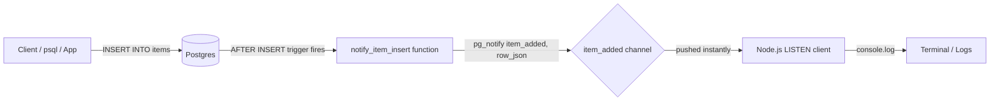
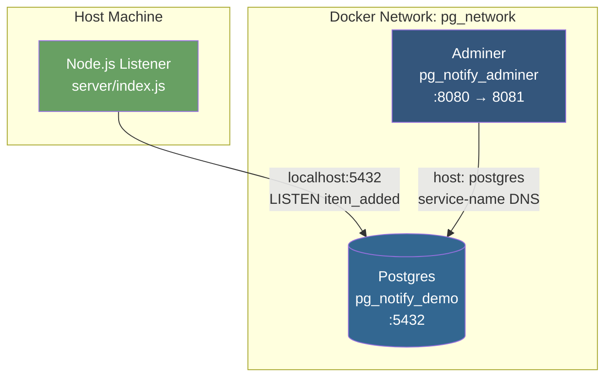
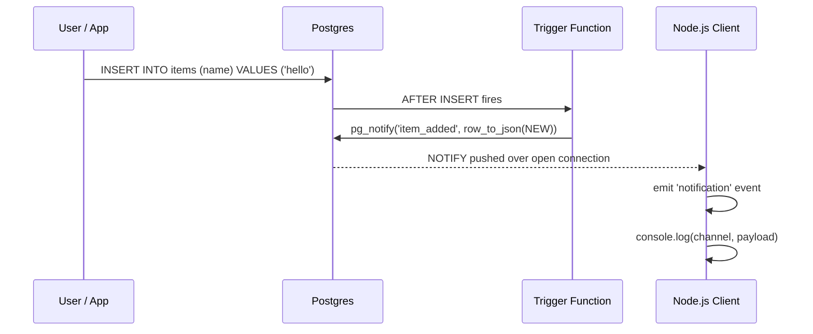
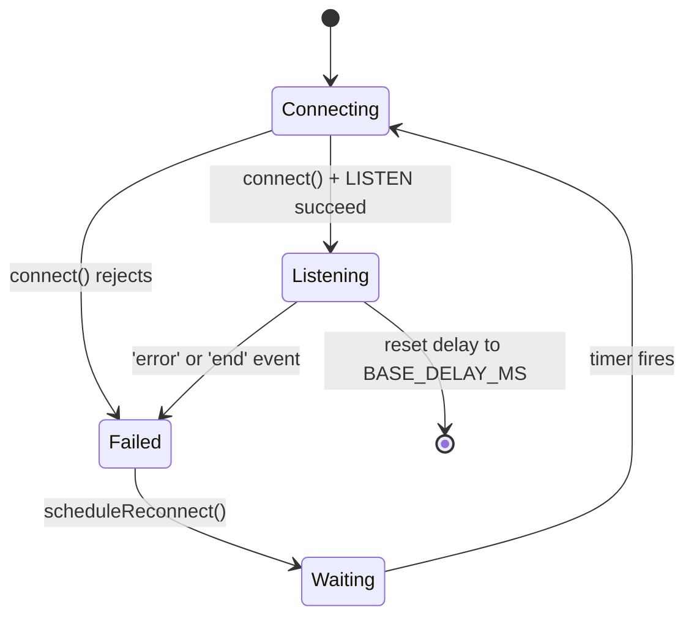
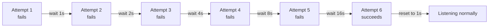

# pg-listen-notify

A minimal, real-time example of PostgreSQL's `LISTEN` / `NOTIFY` mechanism wired up to a Node.js backend. When a row is inserted into the database, a trigger fires a notification that your Node process receives **instantly** — no polling, no cron jobs, no message queue.

Built with **KISS / DRY / YAGNI** in mind: one table, one trigger, one channel, one listener file.

---

## Table of Contents

- [How It Works](#how-it-works)
- [Architecture](#architecture)
- [Project Structure](#project-structure)
- [Prerequisites](#prerequisites)
- [Setup](#setup)
- [Database: Trigger & Function](#database-trigger--function)
- [Node.js Listener](#nodejs-listener)
- [Reconnection & Exponential Backoff](#reconnection--exponential-backoff)
- [Testing It End-to-End](#testing-it-end-to-end)
- [Admin UI (Adminer)](#admin-ui-adminer)
- [Troubleshooting](#troubleshooting)

---

## How It Works

Postgres has a built-in pub/sub system:

- `LISTEN <channel>` — a client subscribes to a named channel over its open connection.
- `NOTIFY <channel>, '<payload>'` (or the function form `pg_notify(channel, payload)`) — anyone (including a trigger) can publish a message to that channel.
- Every connection currently listening on that channel receives the message **immediately**, pushed by Postgres itself.

We hook `pg_notify` into an `AFTER INSERT` trigger, so every time a row lands in the `items` table, Postgres automatically notifies our Node.js process with the new row's data as JSON.



---

## Architecture

Two Docker services on a shared bridge network, plus your Node.js process connecting in from the host.



**Key point:** inside the Docker network, containers reach each other by **service name** (`postgres`), never `localhost`. From your host machine, you reach Postgres via the **published port** (`localhost:5432`), because that's the only part actually exposed outside Docker.

---

## Project Structure

```
.
├── README.md
├── docker/
│   └── docker-compose.yml     # Postgres + Adminer
├── sql/
│   └── tutorial.sql           # table, function, trigger
└── server/
    ├── index.js                # LISTEN client with reconnect + backoff
    ├── package.json
    └── package-lock.json
```

---

## Prerequisites

- Docker + Docker Compose
- Node.js (LTS)

---

## Setup

### 1. Start Postgres (and Adminer)

```bash
cd docker
docker compose up -d
```

`docker/docker-compose.yml`:

```yaml
services:
  postgres:
    image: postgres:latest
    container_name: pg_notify_demo
    restart: unless-stopped
    environment:
      POSTGRES_USER: postgres
      POSTGRES_PASSWORD: postgres
      POSTGRES_DB: notify_demo
    ports:
      - "5432:5432"
    volumes:
      - pg_data:/var/lib/postgresql/data
    networks:
      - pg_network

  adminer:
    image: adminer:latest
    container_name: pg_notify_adminer
    restart: unless-stopped
    environment:
      ADMINER_DEFAULT_SERVER: postgres
    ports:
      - "8081:8080"
    depends_on:
      - postgres
    networks:
      - pg_network

volumes:
  pg_data:

networks:
  pg_network:
    driver: bridge
```

### 2. Apply the SQL (table, function, trigger)

```bash
docker exec -it pg_notify_demo psql -U postgres -d notify_demo -f /dev/stdin < ../sql/tutorial.sql
```

Or connect interactively and run it manually:

```bash
docker exec -it pg_notify_demo psql -U postgres -d notify_demo
```

### 3. Install and run the Node.js listener

```bash
cd ../server
npm install
node index.js
```

You should see:

```
Listening for new items...
```

---

## Database: Trigger & Function

`sql/tutorial.sql`:

```sql
CREATE TABLE items (
  id SERIAL PRIMARY KEY,
  name TEXT NOT NULL
);

CREATE OR REPLACE FUNCTION notify_item_insert()
RETURNS TRIGGER AS $$
BEGIN
  PERFORM pg_notify('item_added', row_to_json(NEW)::text);
  RETURN NEW;
END;
$$ LANGUAGE plpgsql;

CREATE TRIGGER item_insert_trigger
AFTER INSERT ON items
FOR EACH ROW
EXECUTE FUNCTION notify_item_insert();
```

| Piece | Purpose |
|---|---|
| `items` table | The data being watched. |
| `notify_item_insert()` | A trigger function — runs `pg_notify` with the channel name `item_added` and the new row (as JSON text) as the payload. |
| `item_insert_trigger` | Binds the function to fire `AFTER INSERT` on `items`, once per row. |



---

## Node.js Listener

`server/index.js` uses a single dedicated [`pg.Client`](https://node-postgres.com/) connection — **not** a `Pool`. This matters: `LISTEN` binds to one specific TCP connection, so if a pool handed that connection to a different query later, your subscription would silently break. One `Client`, held open forever, is the correct model.

```js
await client.connect();
await client.query('LISTEN item_added');

client.on('notification', (msg) => {
  console.log(`[${msg.channel}]`, JSON.parse(msg.payload));
});
```

- `msg.channel` → `'item_added'`
- `msg.payload` → the JSON string from `row_to_json(NEW)::text`, parsed back into an object

No polling loop — Postgres pushes the moment `pg_notify` runs, so latency is effectively zero.

---

## Reconnection & Exponential Backoff

Networks blip and Postgres restarts. The listener detects a dropped connection and retries with **exponential backoff** — waiting longer between each successive failure, up to a cap — instead of hammering Postgres with instant retries (which is what caused the `sorry, too many clients already` storm during development).





Key design points:

- **A `reconnecting` guard flag** ensures only one reconnect timer is ever scheduled per failure — both `'error'` and `'end'` can fire for the same disconnect, so without the guard you get duplicate/stacked timers (the actual root cause of the earlier connection storm).
- **Delay grows by a fixed multiplier** (`currentDelay *= 2`), not by squaring — true exponential backoff, capped at `MAX_DELAY_MS` so it never grows unbounded.
- **Delay resets to `BASE_DELAY_MS`** the moment a connection + `LISTEN` succeeds, so a long outage doesn't leave you permanently slow to reconnect after recovery.
- **Dead clients are cleaned up** (`removeAllListeners()` + `end()`) before a new one is created, so stale sockets can't keep counting against Postgres's connection limit.

```js
const BASE_DELAY_MS = 1000;
const MAX_DELAY_MS = 30000;
const BACKOFF_FACTOR = 2;

let currentDelay = BASE_DELAY_MS;
let reconnecting = false;

function scheduleReconnect() {
  if (reconnecting) return;
  reconnecting = true;

  if (client) {
    client.removeAllListeners();
    client.end().catch(() => {});
  }

  setTimeout(() => {
    reconnecting = false;
    startListener();
  }, currentDelay);

  currentDelay = Math.min(currentDelay * BACKOFF_FACTOR, MAX_DELAY_MS);
}
```

---

## Testing It End-to-End

**Terminal 1** — start the listener:

```bash
cd server
node index.js
```

**Terminal 2** — insert a row via psql:

```bash
docker exec -it pg_notify_demo psql -U postgres -d notify_demo \
  -c "INSERT INTO items (name) VALUES ('hello world');"
```

**Terminal 1** should immediately log:

```
[item_added] { id: 1, name: 'hello world' }
```

**Simulate an outage:**

```bash
docker restart pg_notify_demo
```

Watch Terminal 1 back off and reconnect automatically once Postgres is healthy again.

---

## Admin UI (Adminer)

A lightweight, session-less DB browser is included so you don't need to install a native Postgres client.

1. Open **http://localhost:8081**
2. System: `PostgreSQL`
3. Server: `postgres` (pre-filled via `ADMINER_DEFAULT_SERVER`)
4. Username: `postgres` / Password: `postgres`
5. Database: `notify_demo`
6. Host: for that run this  ``docker network inspect bridge --format '{{(index .IPAM.Config 0).Gateway}}'``

> Adminer was chosen over pgAdmin for this project after pgAdmin's session-cookie handling proved unreliable behind proxied dev-container URLs (see [Troubleshooting](#troubleshooting)). Adminer is a single stateless PHP page — no server-side session to break.

---

## Troubleshooting

| Symptom | Cause | Fix |
|---|---|---|
| `connection to server at "localhost" ... Connection refused` (inside Adminer) | Used `localhost` as the DB host from *inside* a container | Use the Docker **service name** (`postgres`), not `localhost` — containers resolve each other by service name over the shared network. |
| `sorry, too many clients already` + endless `Connection closed. Reconnecting...` | Multiple reconnect timers stacking per failure (no guard flag) | Use the guarded `scheduleReconnect()` shown above; restart Postgres to clear zombie connections: `docker restart pg_notify_demo`. |
| Node process exits on Postgres restart | No `'error'` handler on the client | Always attach `client.on('error', ...)` — an unhandled client error crashes the process. |

---

## Design Principles

- **KISS** — one table, one trigger, one channel, one file. No ORM, no message broker.
- **DRY** — connection setup lives in a single `startListener()` function, reused on every reconnect attempt.
- **YAGNI** — no multi-channel routing, no connection pooling, no exponential-backoff jitter or max-retry limit — add these only if a real production need shows up.
